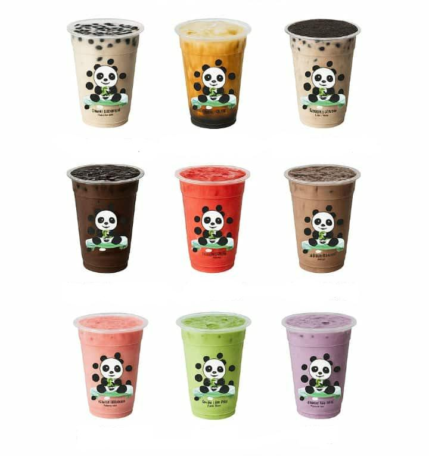
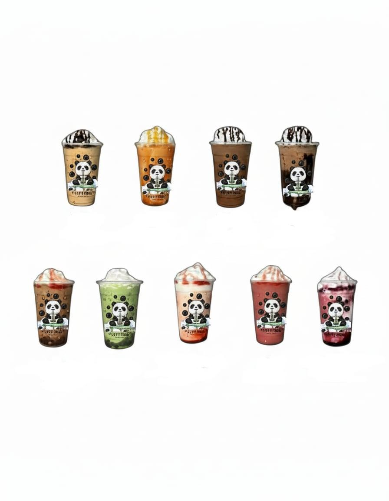
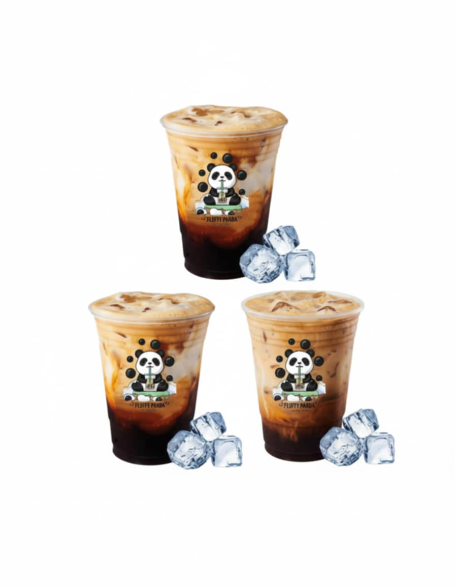
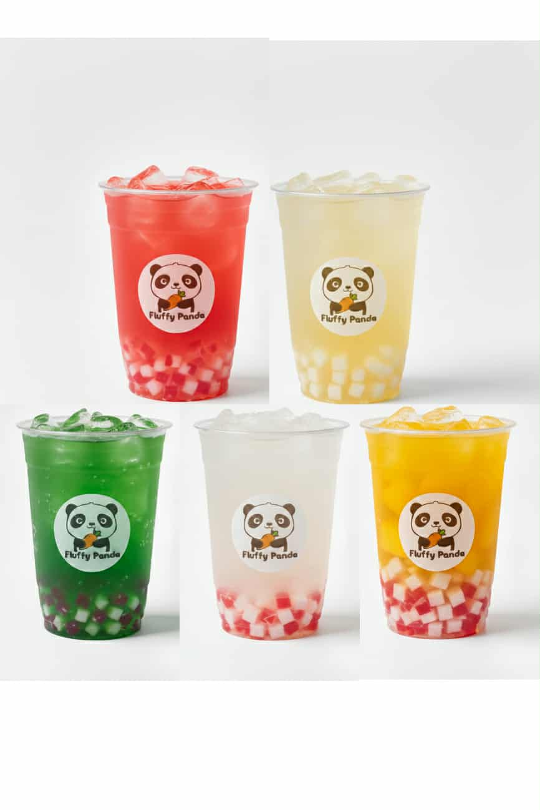
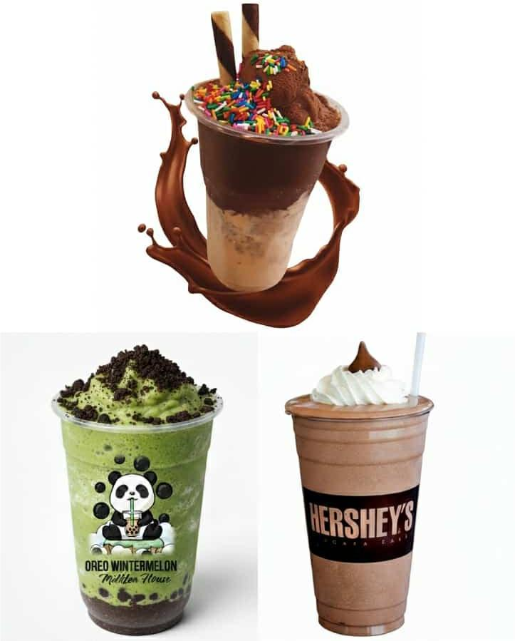
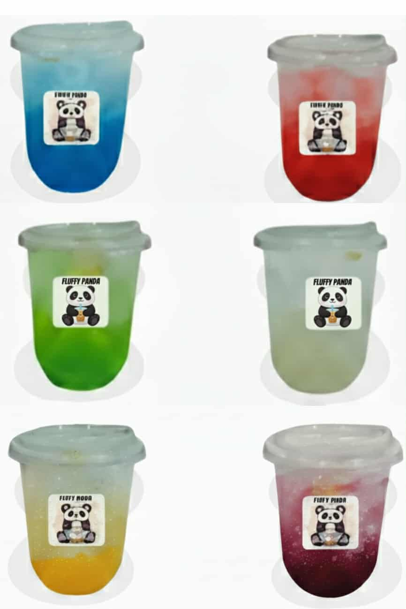
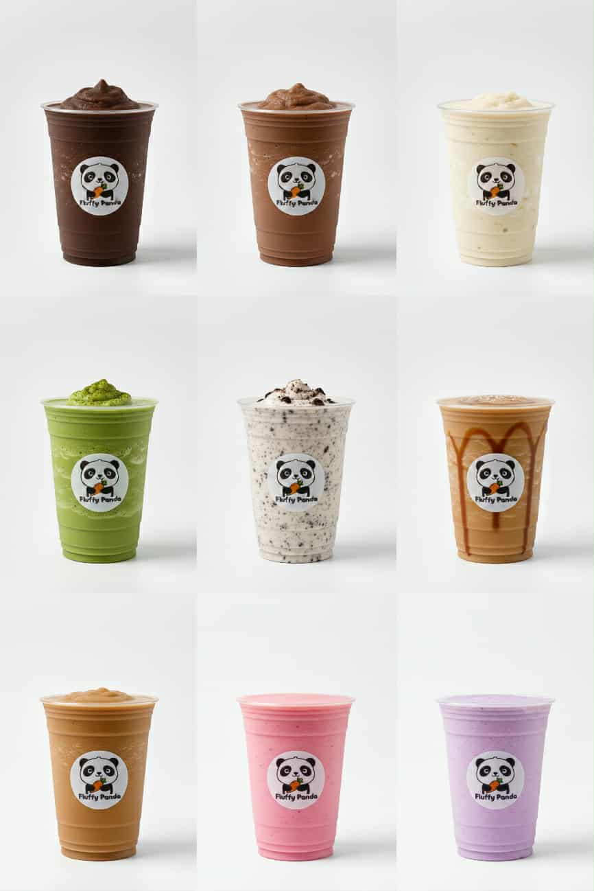
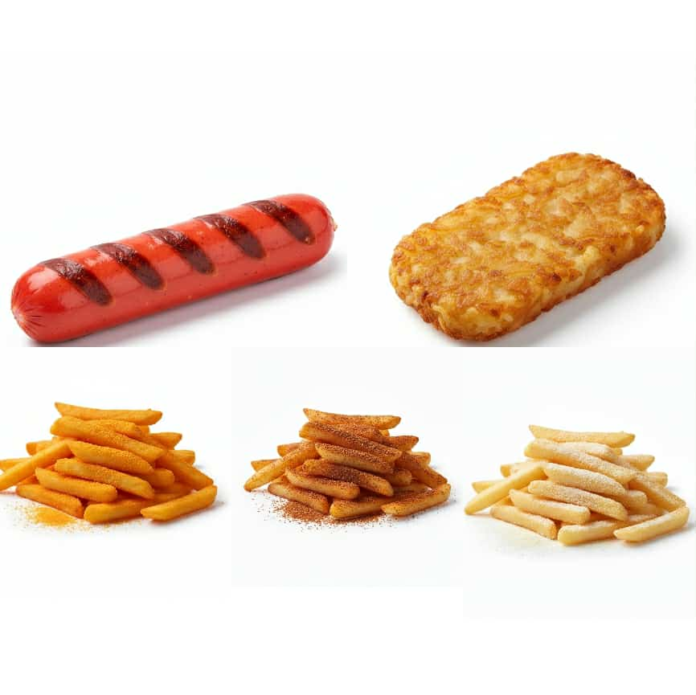

<!DOCTYPE html>
<html lang="en">   
<head>
    <meta charset="UTF-8">
    <meta name="viewport" content="width=device-width, initial-scale=1.0">
    <title>Fluffy Panda Milktea House</title>
    <link rel="shortcut icon" href="12.png">
    <link href="https://fonts.googleapis.com/css2?family=Quicksand:wght@400;600;700&family=Poppins:wght@300;400;500&display=swap" rel="stylesheet">

 
</head>
<body>

    <nav>
  

    

      
      <h3 class="brand-name">FLUFFY PANDA</h3>
    

    

      <a href="#section1">Home</a>
      <a href="#section2">About</a>
      <a href="#section3">Menu</a>
      <a href="#section4">Why Us</a>
      <a href="#section5">Contact</a>
    

  

</nav>

    <section id="section1">
        

            <h1>Welcome to Fluffy Panda</h1>
            <h2>Your Cozy Spot for Milktea & Snacks</h2>
        

    </section>

    <section id="section2">
        

            <h2>Our Story</h2>
            

                Fluffy Panda is more than just a milk tea house—it's a cozy gathering spot. 
                Conveniently located in front of Star Elementary beside Bagong Silang High School, 
                we're known for our best-selling milk tea. We've expanded our menu to offer a delightful 
                range of snacks, including fries and hotdogs, alongside variations of milk tea, 
                ice cream, and coffee-based flavors to satisfy every craving.
            

        

    </section>

    <section id="section3">
        

            <h2>Menu Highlights</h2>
            

                <a href="product1.html" class="product">
                    
                    

                        <h3>Milk Tea</h3>
                    

                </a> 

                <a href="product2.html" class="product">
                    
                    

                        <h3>Frappe</h3>
                    

                </a>

                <a href="product3.html" class="product">
                    
                    

                        <h3>Iced Coffee</h3>
                    

                </a>

                <a href="product4.html" class="product">
                    
                    

                        <h3>Fruit Tea</h3>
                    

                </a>

                <a href="product5.html" class="product">
                    
                    

                        <h3>Shake</h3>
                    

                </a>

                <a href="product6.html" class="product">
                    
                    

                        <h3>Fruit Soda Drinks</h3>
                    

                </a>

                <a href="product7.html" class="product">
                    
                    

                        <h3>Milk Shake</h3>
                    

                </a>

                <a href="product8.html" class="product">
                    
                    

                        <h3>Snacks</h3>
                    

                </a>
            

        

    </section>

    <section id="section4">
        

            <h1>Why Choose Us?</h1>
            <h3>
                Fluffy Panda is a modern milk tea shop designed for comfort and quality.
                Our goal is to provide a relaxing atmosphere where customers can enjoy 
                high-quality milk tea, delicious snacks, and great company. We focus on 
                variety and value to make every visit worthwhile.
            </h3>
        

    </section>

    <section id="section5">
        

             <h1>Get In Touch</h1>
            <h1>Visit our FB Page: Fluffy Panda Milktea House</h1>
            <h1>Location: Right in front of Star Elementary School</h1>
            <h1>Contact: 09679470170</h1>
        

    </section>

    <footer>
        © 2025 Fluffy Panda Milktea House. All rights reserved.
    </footer>

</body>
</html>
